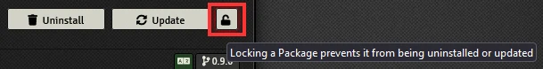

# My Shared Compendia

A Foundry VTT module to share Data between worlds via compendia.

## Installation

1. Go to the Add-on Modules tab within the FoundryVTT Configuration and Setup page.
2. Click the `Install Module` button.
3. Paste the Module's [Manifest URL](https://github.com/stschoelzel/My-Shared-Compendia/releases/download/v1.2.0/module.json)
   into the `Manifest URL` field.
4. Click the `Install` button.

| WARNING: If you update this module, FoundryVTT will erase your compendia. |
| ------------------------------------------------------------------------- |

### Preventing Module Update

- Option 1 (easier): Locking your module:
  1. Go to the Add-on Modules tab within the FoundryVTT Configuration and Setup page.
  2. Find this module (My Shared Compendia) in the list, and click the padlock icon.
     - Unlocked:  
       
     - Locked:  
       
- Option 2: Updating your `module.json` file:
  1. Go to the Module's installation folder within foundry (`~/Data/modules/My Shared Compendia`) and update the `module.json` file.
  2. Remove lines 68-69 (`download` and `manifest`) and save the file.
  3. Restart Foundry to reload the module.

### Unlock your Compendia!

_Remember_ that you need to unlock your compendia to be able to add things to them.

## Default Setup

This module comes with 12 Default compendia:

- `Actors (shared)` ([Actor](https://foundryvtt.com/api/Actor.html))
- `Classes (shared)` ([Item](https://foundryvtt.com/api/Item.html))
- `Feats (shared)` ([Item](https://foundryvtt.com/api/Item.html))
- `Items (shared)` ([Item](https://foundryvtt.com/api/Item.html))
- `Journal Entries (shared)` ([JournalEntry](https://foundryvtt.com/api/JournalEntry.html))
- `Macros (shared)` ([Macro](https://foundryvtt.com/api/Macro.html))
- `Monsters (shared)` ([Actor](https://foundryvtt.com/api/Actor.html))
- `Playlists (shared)` ([Playlist](https://foundryvtt.com/api/Playlist.html))
- `Roll Tables (shared)` ([RollTable](https://foundryvtt.com/api/RollTable.html))
- `Scenes (shared)` ([Scene](https://foundryvtt.com/api/Scene.html))
- `Spells (shared)` ([Item](https://foundryvtt.com/api/Item.html))
- `Subclasses (shared)` ([Item](https://foundryvtt.com/api/Item.html))

## Customize

To change the default setup, edit the `module.json` file. All compendia are defined within the "packs" attribute beginning with line 10.

For example:

```json
{
  "packs": [
    {
      "name": "monsters",
      "system": "dnd5e",
      "label": "Monsters",
      "path": "./packs/monsters.db",
      "module": "my-shared-compendia",
      "type": "Actor"
    },
    {
      "name": "my-custom-items",
      "system": "dnd5e",
      "label": "My Custom Items",
      "path": "./packs/items.db",
      "module": "my-shared-compendia",
      "type": "Item"
    }
  ]
}
```

Note: There are no compendium Types for Classes, Feats, and Features in Foundry, so the `Item` type is generally used for these.

## Dependencies

- [DnD5e Game System](https://github.com/foundryvtt/dnd5e) is required: The Game System adds some SRD Compendia.
- Using [Compendium Folders](https://github.com/earlSt1/vtt-compendium-folders) is highly recommended.

# Credits

Credit for the cleaner version goes to [npiani](https://github.com/npiani).
Process explained by [/u/solfolango](https://www.reddit.com/u/solfolango) on [/r/FoundryVTT](https://www.reddit.com/r/FoundryVTT/comments/fvw3c7/how_to_create_a_tiny_module_for_shared_content/).
